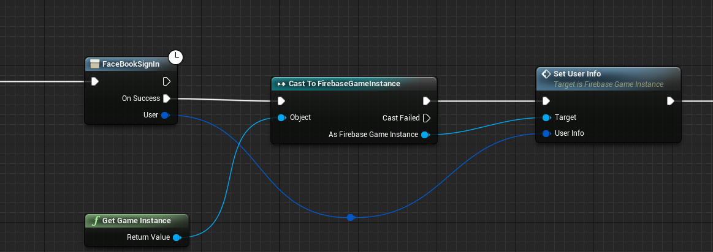
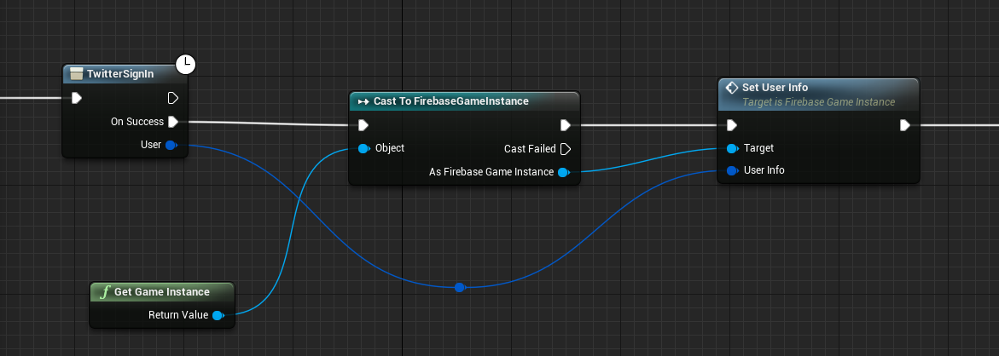
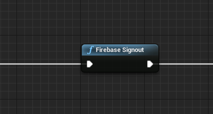
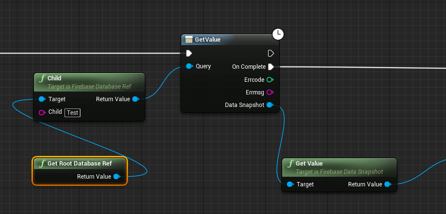
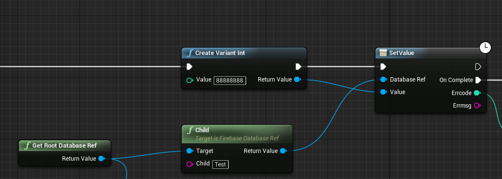
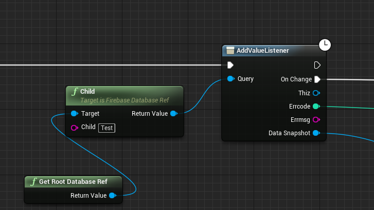
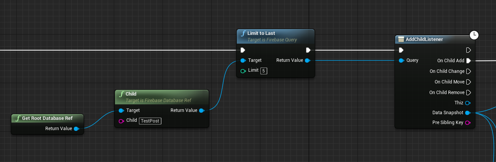

# UnrealEngine4-EZ-Mobile-Ads
this is a firebase basic plugin for unreal engine 4 mobile developer, both c++ and blueprint supported.

This plugin currently is only support android(ios will later support), it contains firbase authentication and fireabse realtime database.
With authentication, you can easily use blueprint or c++ to implement login with facebook, twitter, google and anonymously.
With realtime database, you can do a lot of amazing things.

# FEATURES: 

★  firebase authentication(google, facebook, twitter, anonymously).

★  firebase realtime database.

★  supoort unreal engine 4 4.17.

★  support via e-mail feixuwu@outlook.com

# PLATFORM SUPPORTED:
★ Android(you can only test on device)

# Install

This is a normal c++ plugin, if you do not familiar with how to add plugin to your project,
see [this video](https://youtu.be/DRtkq0ewTz4) to learn how to add c++ plugin to your project.

# Usage
  The best practice to learn how to use this plugin, is to read my demo project blueprint code. To test the project, you need to 
  package the project to android with distribution setting.
  To see this demo how to work, you can direct download the apk from [this](https://www.dropbox.com/s/tsv5ajjgymzcl5n/UEFireBase-Android-Shipping-armv7-es2.apk?dl=0).
  
  ****Note:please do not use my google-services.json for your own product, you should create your own project on firebase console.
  
  
★ Facebook Login
	
	

★ Twitter Login
	
  
★ Google Login  
	
	
	
★ Firebase Logout
	
  
 
★ Firebase Realtime Database ReadValue
	
	
★ Firebase Realtime Database SetValue
	
	
	
★ Firebase Realtime Database Value Listener
	

★ Firebase Realtime Database Child Listener
	

  
# License
 This is an open source project, you can use it free. If you think this project useful, please give me a star to let me know 
it is useful, so I'll continue make it better and add more firebase module.
